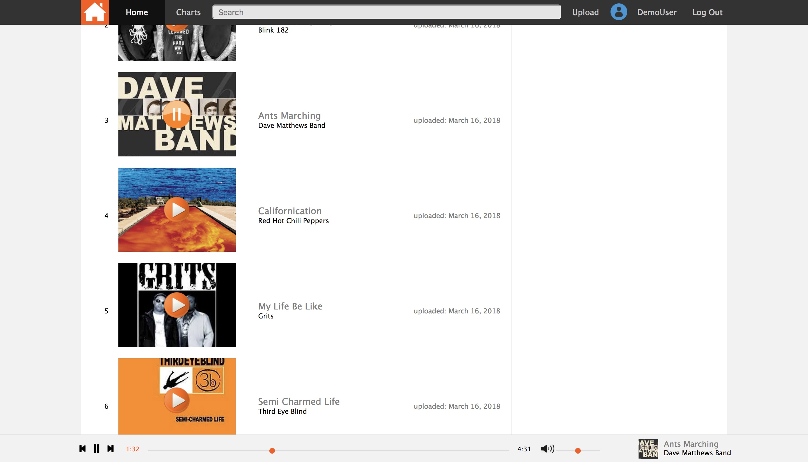
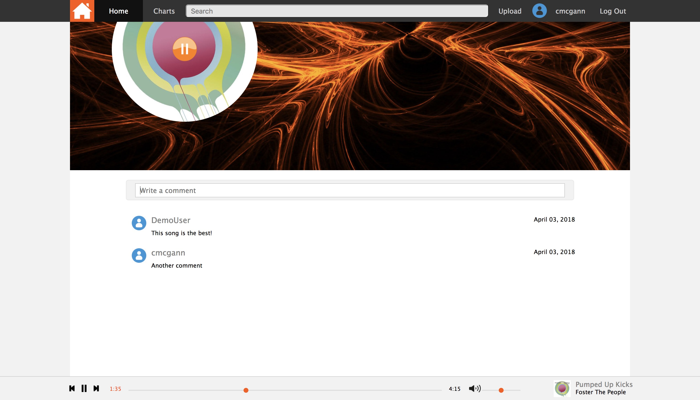
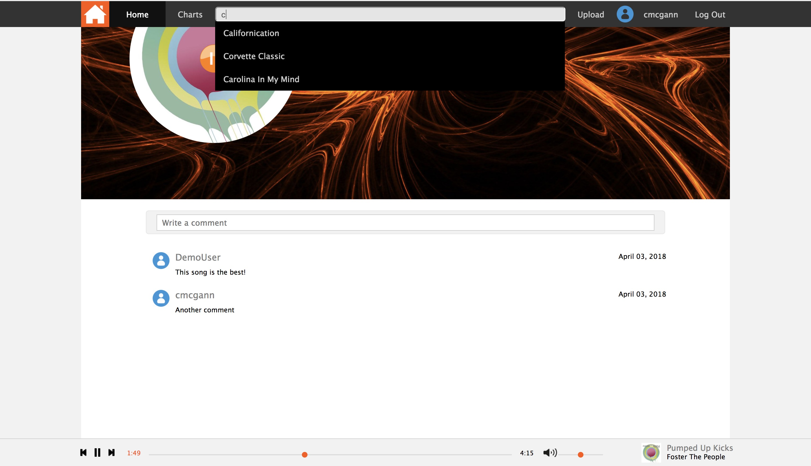

# SoundTown

SoundTown is a web application for sharing and listening to music. It was inspired by SoundCloud and built using Ruby on Rails, React, Redux and Javascript. This project is under active development and new features will continue to be added.

Explore and Listen [here](http://soundtown.herokuapp.com/#/).

## Features

Account creation with back and front-end authentication using BCrypt
  * Users can create acounts as well as log in /out
  * Uploads / comments are displayed on user profile pages, both can be directly viewed or deleted by the respective user

Upload songs and album images
  * Upload songs with title, artist name and an album cover image

Continuous audio playback that follows you throughout the site
  * Ability to play/pause songs from anywhere on the site
  * Song continually plays when you move to a different page
  * Ability to adjust volume / current time position in the song

Comment on tracks
  * Users can comment on any track, and delete and of their own comments on any given track

# Continuous Audio Playback:

The app features two different audio playing React components, the audio footer playbar and the album cover player.  The audio footer player is present on every page, which allows for continuous audio playback, and is which built off of HTML 5s audio tag. The audio player is built in sync with other custom built audio players throughout the site by transferring the audio's play / pause state through the redux state.  The audio element associated with the audio footer is updated through the global slice of state for play, pause, a change in the point of the song, and volume.

```javascript
{ currentSong:
 { song: {id: 23, user_id: 5, title: "SongTitle", etc...}
   isPlaying: False
 }
}
```

# Comments:

User have the ability to comment on any songs uploaded to SoundTown, as well as delete any comment that they write.  Comments are associated with the song they belong to and are rendered on each song show page in descending order

# Search:

User have the ability to comment on any songs uploaded to SoundTown, as well as delete any comment that they write.  Comments are associated with the song they belong to and are rendered on each song show page in descending order

# Future Features:
* Waveforms
* Likes and Follows
* Playlists
* Additional views to help with discovering music
